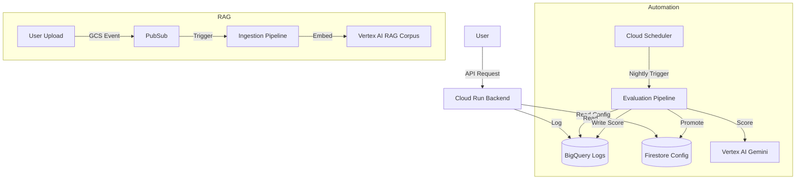

# Terraform & Infrastructure Deployment Guide

This document is your definitive guide to setting up the Google Cloud infrastructure for the LLMOps system using Terraform. It explains *what* we are building, *how* to build it, and *what* to do after the infrastructure is ready.

---

## 1. Overview: What is Terraform doing?

Terraform is our "Infrastructure as Code" (IaC) tool. Instead of clicking buttons in the Google Cloud Console, we define our desired state in `.tf` files. Terraform then talks to the Google Cloud API to make that reality happen.

### The Stack ("The `infra/` Directory")

| File | Resources Created | Purpose |
| :--- | :--- | :--- |
| **`main.tf`** | APIs, Artifact Registry, Service Accounts, IAM Roles | The foundation. Enables services (Vertex AI, Cloud Run) and creates the identities (Service Accounts) that run them. |
| **`bigquery.tf`** | Dataset (`llmops`), Tables (`requests`, `evaluation`, `experiments`) | The "Data Warehouse". Stores logs, eval scores, and A/B test results. |
| **`storage.tf`** | GCS Buckets (`-docs`, `-pipeline-artifacts`, `-test-sets`) | The "File System". Stores user uploads, compiled pipelines, and test data. |
| **`pubsub.tf`** | Pub/Sub Topic & Notification | The "Event Bus". Notifies the system when a file is uploaded to GCS. |
| **`scheduler.tf`** | Cloud Scheduler Jobs | The "Cron". Wakes up every night to run evaluation pipelines. |
| **`monitoring.tf`** | Alert Policies | The "Watchdog". Emails you if latency is high or errors spike. |

---

## 2. Prerequisites & Permissions

Before running Terraform, ensure:

1.  **Google Cloud Project**: You must have a project ID (e.g., `project-12345`).
2.  **Permissions**: Your user account (the one running `terraform apply`) needs **Editor** or **Owner** role on the project to create these resources.
3.  **Tools**:
    *   `terraform` (v1.5+)
    *   `gcloud` CLI (authenticated via `gcloud auth application-default login`)

---

## 3. Step-by-Step Deployment

Follow this exact sequence to bring the system to life.

### Phase 1: Infrastructure (Terraform)

1.  **Authenticate**:
    ```bash
    gcloud auth application-default login
    gcloud config set project YOUR_PROJECT_ID
    ```

2.  **Initialize**:
    ```bash
    cd infra
    terraform init
    ```

3.  **Plan**:
    See what will be created.
    ```bash
    terraform plan -var="project_id=YOUR_PROJECT_ID"
    ```

4.  **Apply**:
    Create the resources.
    ```bash
    terraform apply -var="project_id=YOUR_PROJECT_ID" -var="alert_email=your-email@example.com"
    ```
    *Type `yes` when prompted.*

    **Result**: You now have buckets, tables, service accounts, and topics. But they are empty.

### Phase 2: Pipeline Artifacts (Post-Terraform)

The Cloud Scheduler relies on compiled pipeline files (`.json`) existing in your GCS bucket. Terraform creates the bucket, but *you* must upload the files.

1.  **Compile & Upload**:
    ```bash
    # From project root
    bash xyz/scripts/deploy_pipelines.sh YOUR_PROJECT_ID
    ```
    *This script compiles the Python pipeline code into JSON and uploads it to `gs://YOUR_PROJECT_ID-llmops-pipeline-artifacts/pipelines/`.*

### Phase 3: Application Data Seeding

The infrastructure is up, but the databases need initial data.

1.  **BigQuery Schemas** (Optional, Terraform usually handles this, but good for verification):
    ```bash
    python xyz/scripts/setup_bigquery.py --project YOUR_PROJECT_ID
    ```

2.  **Firestore Configs**:
    Creates the initial "default_llm" and "rag_bot" configurations.
    ```bash
    python xyz/scripts/seed_firestore_config.py --project YOUR_PROJECT_ID
    ```

3.  **RAG Corpus**:
    Creates the Vector Search index in Vertex AI (Terraform doesn't fully support this yet).
    ```bash
    python xyz/scripts/setup_rag_corpus.py --project YOUR_PROJECT_ID --app_id rag_bot
    ```

---

## 4. Your Role: How to Run & Monitor

Once everything is deployed, the system is largely automated. Here is your operational dashboard.

### A. The "Loop" (Daily Operation)

1.  **Users** chat with the bot.
    *   **You check**: BigQuery `requests` table.
    *   *Query*: `SELECT * FROM llmops.requests ORDER BY timestamp DESC LIMIT 10`

2.  **Documents** are uploaded.
    *   **Action**: `gsutil cp my_doc.pdf gs://YOUR_PROJECT_ID-llmops-docs/rag_bot/`
    *   **System**: Pub/Sub triggers -> Cloud Function (if deployed) or you manually trigger the `rag_ingestion` pipeline.
    *   **You check**: Vertex AI Pipelines Console -> "Runs".

3.  **Nightly Evaluation**.
    *   **System**: At 2 AM IST, Cloud Scheduler kicks off `evaluation_pipeline`.
    *   **You check**: BigQuery `evaluation_results` table.
    *   *Query*: `SELECT avg_score, judge_explanation FROM llmops.evaluation_results WHERE app_id='rag_bot'`

### B. Manual Interventions

Sometimes you want to force things:

*   **Force an Evaluation Run**:
    ```bash
    python xyz/pipelines/evaluation_pipeline.py --project YOUR_PROJECT_ID --submit --app_id rag_bot
    ```

*   **Run an Experiment (A/B Test)**:
    If you want to test a new model:
    ```bash
    python xyz/pipelines/experiment_pipeline.py \
      --project YOUR_PROJECT_ID \
      --model_a gemini-2.0-flash \
      --model_b gemini-2.0-pro-exp \
      --submit
    ```

### C. Monitoring

*   **Alerts**: Check your email. If the backend fails (5xx errors) or gets slow (>5s), you will get an email.
*   **Console**: Go to **Google Cloud Console > Vertex AI > Pipelines** to see the visual graph of your automation.

---

## 5. Summary of Architecture



```
